# System Design

**Contents**

- [Architecture of the entire system](#architecture-of-the-entire-system)
- [The design of 3 key systems](#the-design-of-3-key-systems)
- [User stories](#user-stories)
- [The evolution of Wireframes](#the-evolution-of-UI-wireframes)
- [Communication Protocols](#communication-protocols)
- [Data persistence mechanisms](#data-persistence-mechanisms)
- [Web Technologies](#web-technologies)


## Architecture of the entire system  

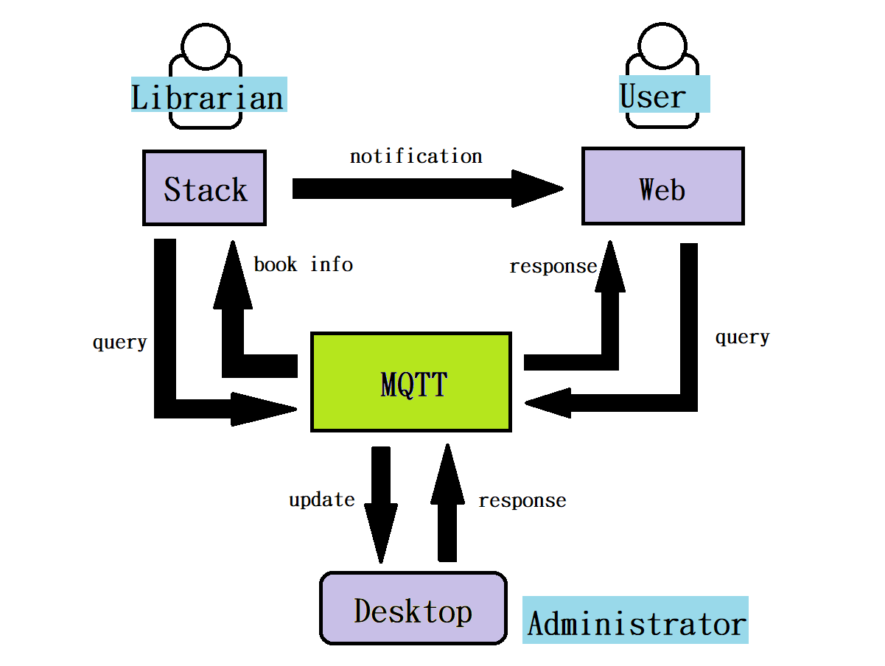

The main purpose of this project is to build a simple library management system, with the functions of user query and reservation. Also, the librarian can update the status of the book in real time, and notify the user that the borrowed book is now available.

The following are the roles played by each character in this system:

User can register account, login, query and check the status of books or book them on the web page. Librarian can scan the code on book to receive the message from administrator by m5stack, and return the book to the right bookshelf or notify the user who has booked this book. Administrator can response the query from user, send message to m5stack, and use various functions of the library management system interface to display information such as book status and inventory.

Web page, M5stack, desktop connect and send query or response by MQTT.
    
## The design of 3 key systems
###   Desktop Application

The desktop application of the library management system serves library administrators and is mainly used for library book status management and book situation visualization. The page mainly includes four parts, including an overview of books in the upper left corner, a list of book status classifications in the upper right corner, a display of book details in the middle right, and a book classification chart at the bottom.

The library includes four areas: A / B / C / D. 
There are four states in the book: 
* available (currently available in the library), 
* borrowed (already borrowed), 
* exceptional (already returned but not placed in a suitable location), 
* reserved (already reserved)

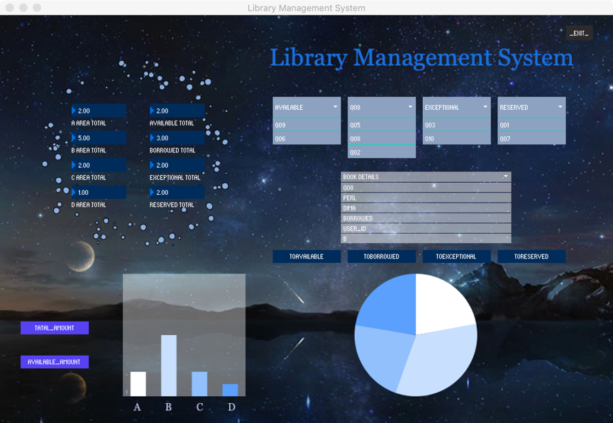

#### 1. Overview of books

The book overview section is divided into two categories for display. On the left is the display of the number of books (divided according to the four areas of the library), and on the right is the display of the number of books (the current four statuses of books are divided). When the book situation changes (new book storage or book status changes), this part can display the latest number distribution in real time.

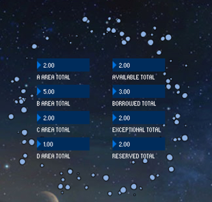
 
#### 2. Book status classification list

According to books available, Borrowed, exceptional, reserved four categories of status display, click on the list to display all the book ID under a certain status. When the state of the book changes, this part can show the latest distribution in real time.

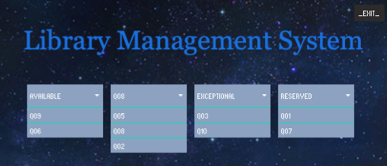
    
#### 3. Book details display
This part is used in conjunction with the book status classification list part. Click the ID of a book in the list to display the details of the book, including:
Book_id, book_name, author_name, book_status, booked person id, area, position, last_borrowed_time, last_return_time and last_warehouse-in_time ten parts.

Book details display. With the four buttons below (TOAVALIBLE, TOBORROWED, TOEXCEPTIONAL, TORESERVED), you can change the status of the currently displayed book. At the same time, the two parts of the book overview and the book status classification list will be updated simultaneously.


In addition, by clicking the button, the corresponding time field of the book will also be changed.
* Click TOAVALIBLE, the last_warehouse-in_time field of the current book is automatically changed to the current time;
* Click TOBORROWED, the last_borrowed_time field of the current book is automatically changed to the current time;
* Click TOEXCEPTIONAL, the last_return_time field of the current book is automatically changed to the current time;

#### 4. Book classification chart

The book classification chart is divided into left and right parts. The left shows the distribution of books in four different areas of the library, and the right shows the distribution of books in four different states.
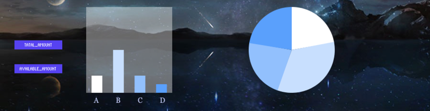


The left part shows the total number of books in the four areas by default. If you click AVALIABLE_AMOUNT, it will switch to the number of books that can be lent out in the four areas. If you click TATAL_AMOUNT, it will return the total number of books in the area.

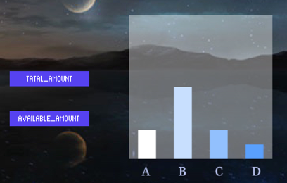
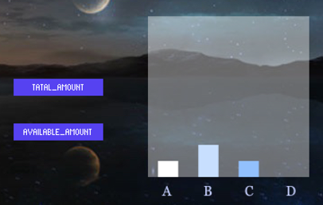

In addition to the above-mentioned functions that can be directly seen, the desktop application of the library management system can communicate with the web page and M5Stack at the same time. After receiving the query or reservation information from the web page, it can automatically update and return the book information. After receiving the query information of M5Stack, it can also automatically update and return the book information.
    
### M5stack:

After m5stack is turned on, it will be able to:
(1)	display the theme and LOGO
(2)	connect to Wi-Fi and MQTT
(3)	scan the barcode of book
(4)	send book id to MQTT & receive the message from the desktop by MQTT
(5)	display the book information
(6)	decide whether to send the reminder according to the status of the book


#### 1. Display the theme and LOGO

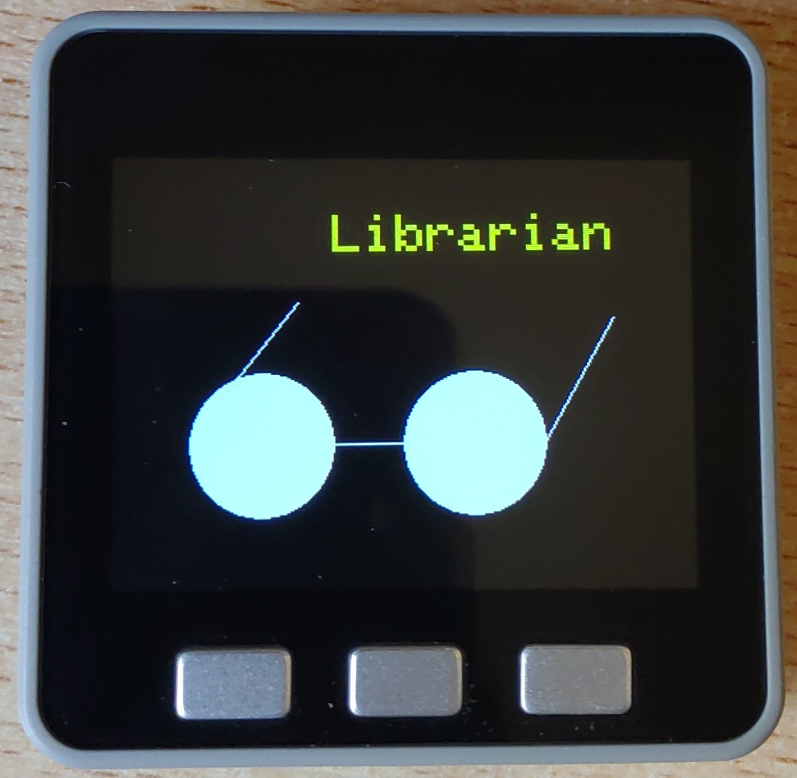

The theme and logo are dynamically displayed on the screen through the use of delay function.

#### 2. Connect to Wi-Fi and MQTT
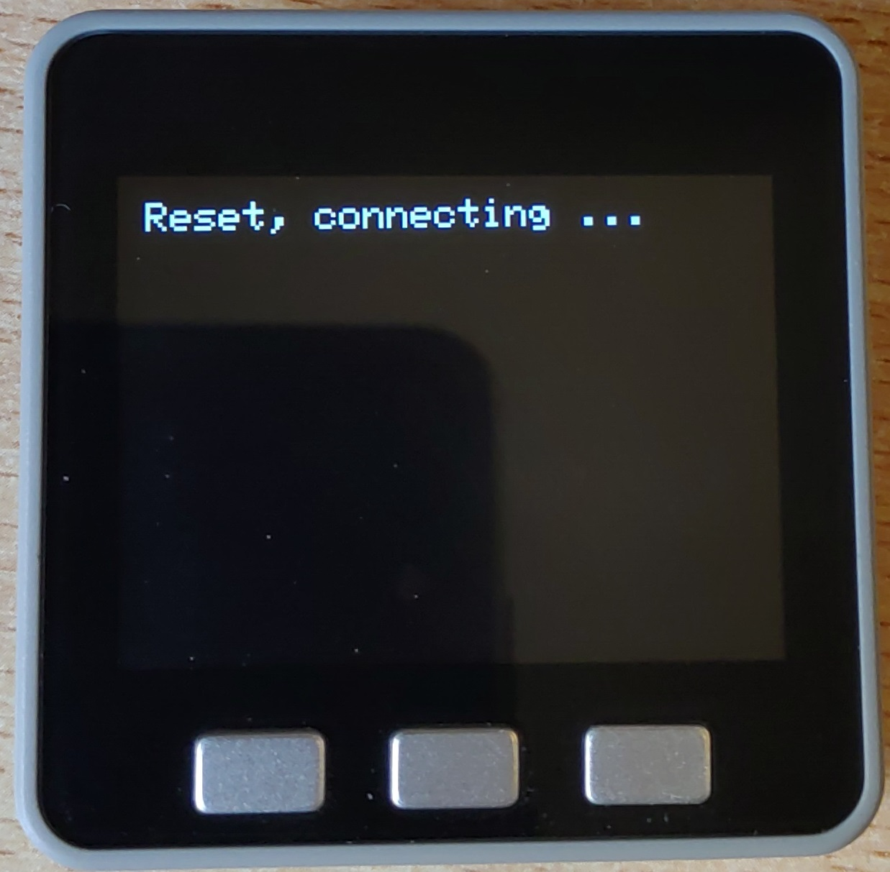

The codes to complete the work of connecting Wi-Fi (UoB Guest) and MQTT are based on template. When communicating with desktop via MQTT, the topic for sending query information is "M5_query", and the topic for obtaining detailed book information is "response_to_M5". When communicating with web, the topic for sending notification is "booked_reminder".

#### 3. Scan the barcode of book


Assuming that m5stack has a camera, the book_id of the book will be obtained after pressing the scan key. By passing the id to MQTT, the desktop is queried for information about this book. User can cancel this scan by pressing cancel key.

#### 4. Send book id to MQTT & receive the message from the desktop by MQTT
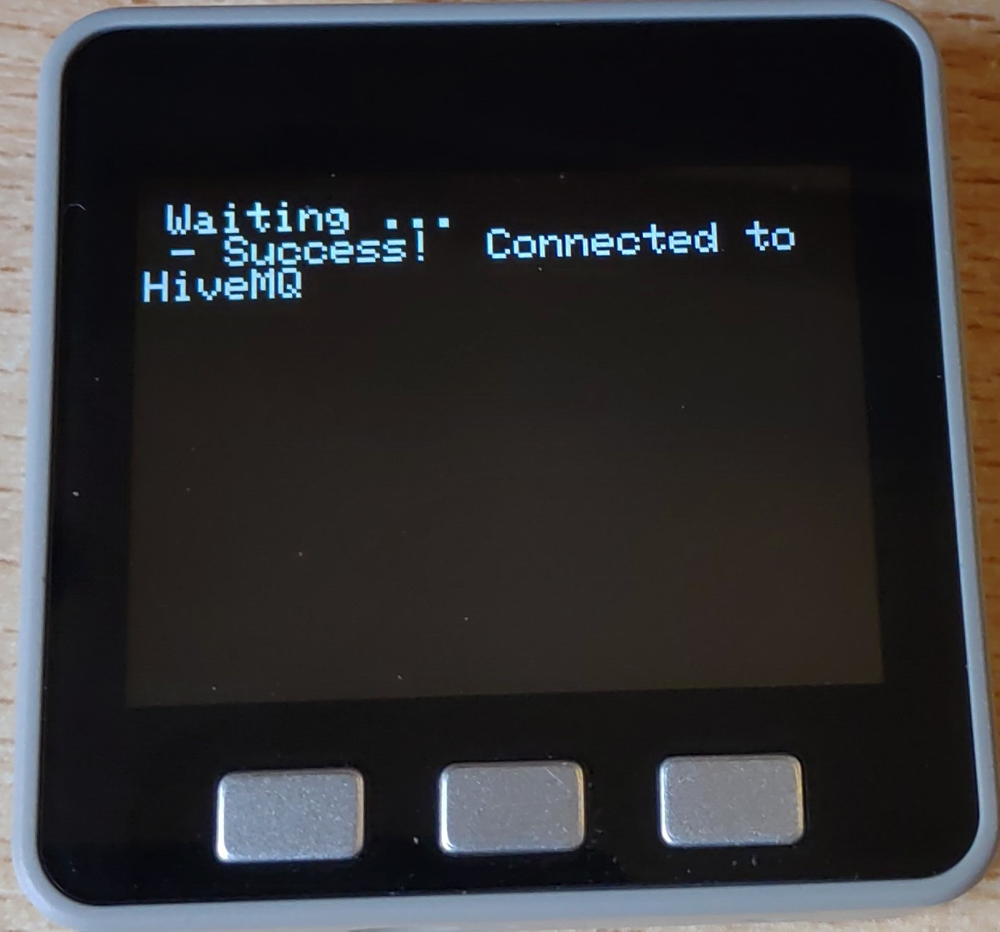
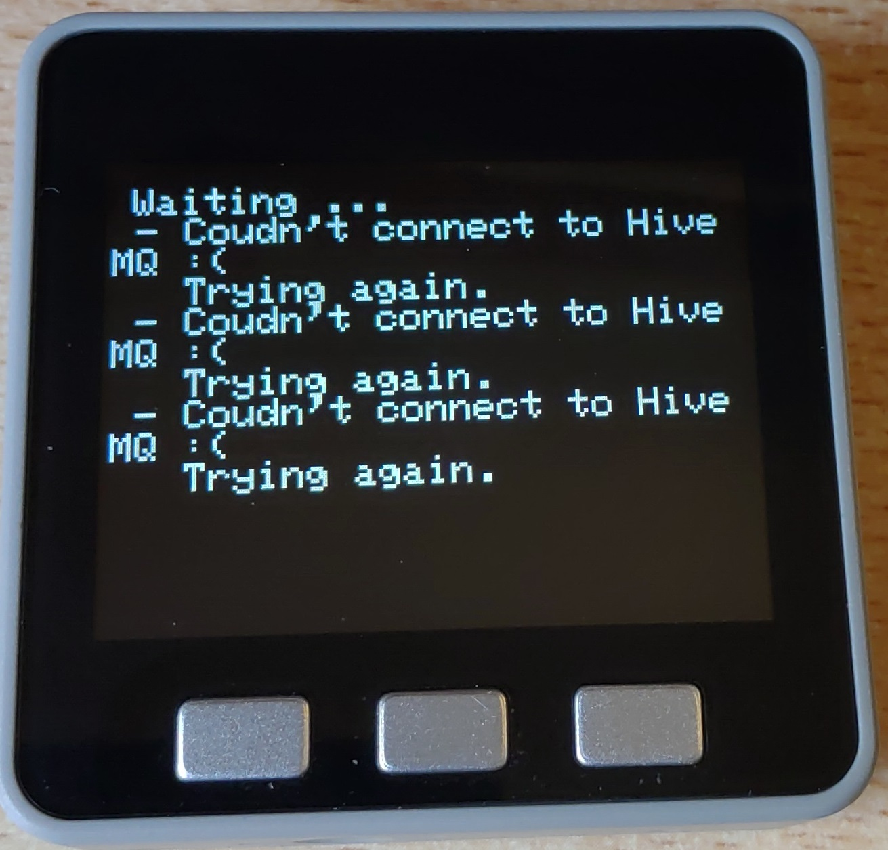

If the connection is successful, the screen will look like the left picture, if it fails, it will look like the right picture.
M5stack sends book_id in form of "book_id": "012" to MQTT with topic "M5_query", and get message in form of json with topic "response_to_M5".

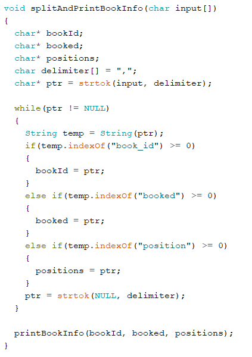

#### 5. Display the book information
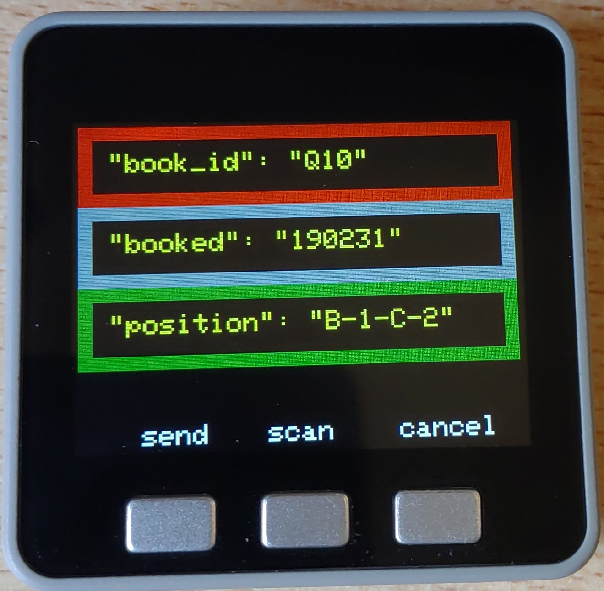

Divide the processed information into "book_id", "booked", and "position", and display them on the screen, waiting for the next processing: send out a reminder or scan the next book.

#### 6. Decide whether to send the reminder according to the status of the book

If the "booked" column shows "user_id" instead of "null", the notification will be sent to the user (through MQTT with topic "user_id") after pressing the send key.
   
## User stories
    分别描述三端用户可能产生的情况
   
## The evolution of UI Wireframes
    UI的改良（但是我们没有用户反馈得编了TT）
1. In the following part of the page design, the original design does not include the TORESERVED button. Only after the user makes a reservation on the web page, the book status may be changed to reserved, but the user reflects that if a user is already in the library, it is currently inconvenient Using the web page to log in to book, it should also be possible for the administrator to book directly on this page and increase the user id.


2. When designing this part, the button function was not added at the beginning, but the two pictures were directly displayed. After the user suggested, adding the button can increase the user interaction and make the page more concise. current state.


   
## Communication Protocols
We use MQTT as our communication protocol because MQTT is a machine-to-machine (M2M)/"Internet of Things"  connectivity protocol. It was designed as an extremely lightweight publish/subscribe messaging transport. It is useful for connections with remote locations where a small code footprint is required and/or network bandwidth is at a premium. 

Our system requires multiple communications in different directions between different devices. Due to the complex communication design of our system, we decided to use multiple different subscriptions in order to clearly publish which messages to which application as following:

### (a) Desktop <——> web
**Web  —— query ——> Desktop** 

*Topic: "WEB_query"*
There are three different conditions when a user query a book information from desktop.
1. only use book_name to query;
2. only use author_name to query;
3. use book_name and author_name to query, e.g:
```
{
  "query_id": "00000001",
  "user_id": "stu190001",
  "book_name": "java",
  "author_name": "Andrew",
  "book_status": "null"
}
```

**Web  —— booking ——> Desktop** 

*Topic: "WEB_query"*
The booking request must include book_name and author_name, and the book_status would change to “booking”.
```
{
  "query_id": "00000001",
  "user_id": "stu190001",
  "book_name": "java",
  "author_name": "Andrew",
  "book_status": "booking"
}
```

**Desktop ——query_response——> web** 

*Topic: "response_to_WEB"*
If desktop could find the corresponding book, it would send the information to the web:
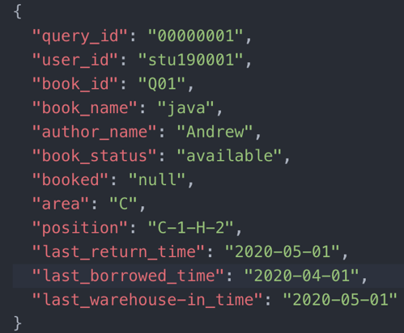

Otherwise, the desktop would send { "book_name": "null" } to the web.

**Desktop ——booking_response——> web** 

*Topic: "response_to_WEB"*
If desktop could find the corresponding book and the status of the book is available, it would change the "book_status" to "booked" and set the value of “booked” is "user_id", then send the updating information to the web.

### (b) Desktop <——> M5 stack
**M5 stack —— query ——> Desktop** 

*Topic: "M5_query"*
M5 stack using book_id to query the information of the book.

**Desktop ——response——> M5 stack** 

*Topic: "topic："response_to_M5""*
M5 stack using book_id to query the information of the book.
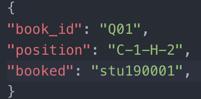

Otherwise, the desktop would send { "book_id": "null" } to the M5 stack.

### (c) M5 stack ——> Web

If the booked field in the desktop reply message received by M5 stack after scanning a book is not empty, M5 stack would send a prompt message with the topic of the current user_id to the Wed (a user). The user receives the reminder and knows he can go to borrow the book now.
   
## Data persistence mechanisms
This design is a lightweight design, so the database is not used, and the json file is used to maintain the book information. The json file of each book is as follows:

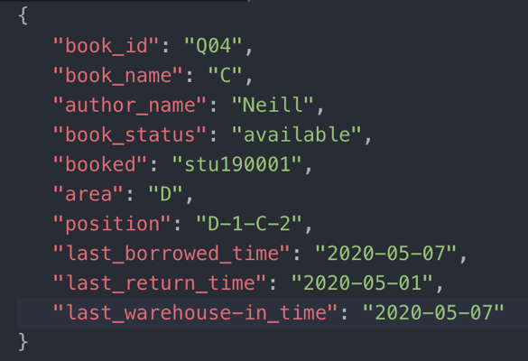

```
"book_id": "Q04", —— Book label, starting with Q;
"book_name": "C", —— Book name
"author_name": "Neill", —— book author
"book_status": "available", —— book status
"booked": "stu190001", —— If the book is booked, the id of the booked user is displayed, otherwise null
"area": "D", —— Area where the book is located
"position": "D-1-C-2", —— The specific position of the book
"last_borrowed_time": "2020-05-07", —— the time the book was last borrowed
 "last_return_time": "2020-05-01", —— the time the book was last returned
 "last_warehouse-in_time": "2020-05-07"-the time when the book was last put back in a fixed position
```
When you receive the reservation information on the web side, the update information on the M5 stack side, and the button operation on the desktop page, you can automatically update the corresponding fields of the json file.

   
## Web Technologies
    写网页用的技术和为什么选择
